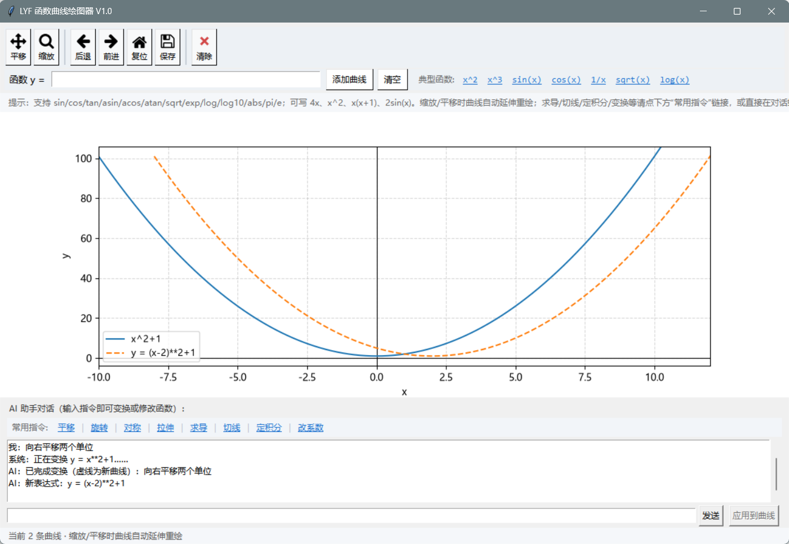
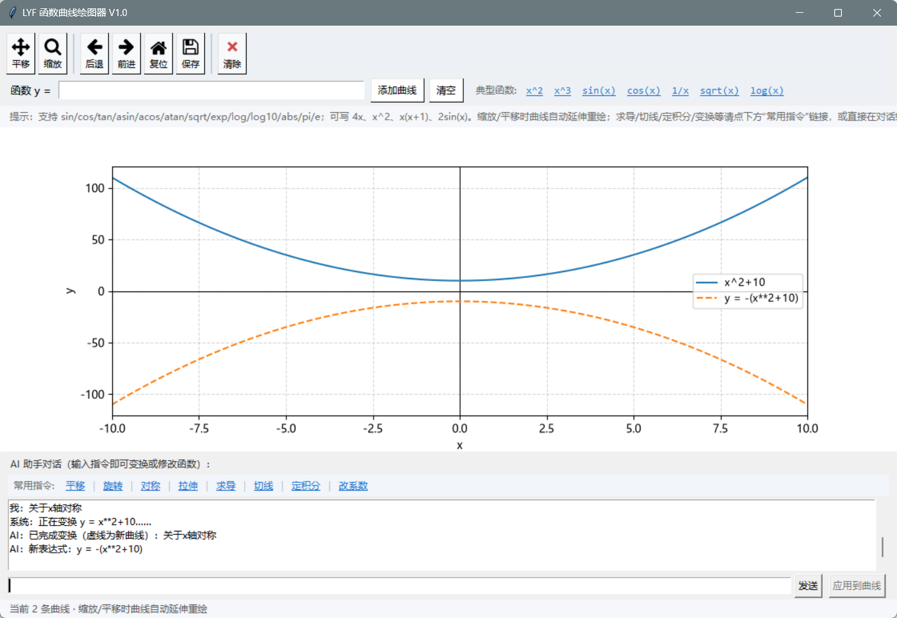

# LYF 函数曲线绘图器 V1.0
中文 | [English](README.en.md)

一个由**大语言模型（DeepSeek）驱动**的交互式函数绘图学习工具：输入函数表达式即可绘图，也可以用自然语言描述「平移、拉伸、对称、旋转」等变换，或直接修改函数表达式，适合中学数学学习与演示。

## ✨ 功能特性

- **函数绘图**：支持 `sin(x)`、`x^2+2x-1`、`1/x`、`sqrt(x)`、`log(x)` 等常见函数，可同时绘制多条曲线
- **数学写法自动识别**：支持 `4x`、`x^2`、`x(x+1)`、`2sin(x)`、`2pi` 等省略乘号的写法
- **AI 自然语言交互**：输入「向上平移2个单位」「纵向拉伸2倍」即可变换曲线；输入「把常数项加2」即可让大模型生成新函数
- **学习功能**：数值导数、切线（标出切点与斜率）、定积分面积（区间涂色）
- **交互视图**：滚轮/框选缩放、平移、复位、保存图片；缩放平移时曲线自动延伸重绘
- **安全求值**：表达式采用 AST 白名单解析，仅允许数学函数，不使用裸 eval

## 📸 界面效果





## 🚀 运行方式

### 方式一：直接运行源码

需要 Python 3.10+，安装依赖：

```bash
pip install numpy matplotlib requests
```

运行：

```bash
python function_plotter.py
```

Windows 用户也可以直接双击 `function_plotter.pyw`（无控制台窗口）。

### 方式二：打包好的 exe

可自行用 PyInstaller 打包成单文件 exe（或关注后续 Releases 发布），双击即可运行，无需安装 Python。

## 🤖 AI 功能说明

首次使用「变换曲线 / 修改函数 / 常用指令」时，程序会提示输入 **DeepSeek API Key**（在 https://platform.deepseek.com 获取）。

- Key 保存在程序目录下的 `config.json` 中
- ⚠️ `config.json` 含密钥，**请勿提交到仓库或分享给他人**

常用指令示例：

| 类别 | 示例 |
| --- | --- |
| 平移 | 向上平移2个单位 / 向左3个单位 |
| 旋转 | 绕原点旋转90度（逆时针为正） |
| 对称 | 关于x轴对称 / 关于y轴对称 / 关于原点对称 |
| 拉伸 | 纵向拉伸2倍 / 横向压缩3倍 |
| 修改 | 把常数项加2 / 系数改成3 / 整体平方 |
| 功能 | 求导 / 切线 / 定积分 |

## 📁 项目结构

```
traetest/
├── function_plotter.py   # 主程序
├── function_plotter.pyw  # Windows 无控制台启动版
├── config.json           # DeepSeek API Key（不入库，本地生成）
└── icons/                # 顶部按钮图标
```

## 🛡️ 安全说明

- 表达式求值使用 AST 白名单，只允许四则运算、幂运算和注册的数学函数
- API Key 仅保存在本地 `config.json`，已通过 `.gitignore` 排除

## 📄 说明

本项目为个人学习项目（作者：LYF），欢迎 fork 学习交流。

